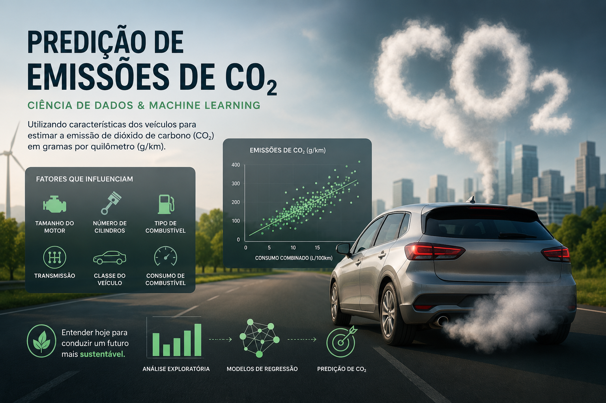

# Predição de Emissões de CO₂ em Veículos



Este projeto utiliza uma base de dados pública disponibilizada pelo governo canadense contendo informações técnicas e de consumo de combustível de veículos leves comercializados no Canadá.

O objetivo principal é desenvolver um modelo de **Machine Learning para Regressão** capaz de estimar a quantidade de dióxido de carbono (CO₂) emitida por um veículo, medida em gramas por quilômetro (g/km), a partir de características como:

- Fabricante
- Modelo
- Classe do veículo
- Tamanho do motor
- Número de cilindros
- Tipo de transmissão
- Tipo de combustível
- Consumo urbano
- Consumo rodoviário
- Consumo combinado

O projeto contempla todas as etapas do ciclo de desenvolvimento de uma solução de Ciência de Dados:

- Análise exploratória dos dados (EDA)
- Tratamento e preparação dos dados
- Engenharia de atributos
- Treinamento de modelos de regressão
- Avaliação de desempenho
- Interpretação dos resultados
- Deploy da aplicação utilizando Streamlit

## Organização do projeto

```text
├── .gitignore         <- Arquivos e diretórios ignorados pelo Git
├── environment.yml    <- Dependências necessárias para reproduzir o ambiente
├── LICENSE            <- Licença do projeto
├── README.md          <- Documentação principal do projeto
│
├── dados
│   ├── canada_{ano}   <- Dados originais
│   ├── tratados       <- Dados após limpeza e transformação
│   └── consolidados   <- Dados preparados para modelagem
│
├── modelos            <- Modelos treinados e serializados
│
├── notebooks          <- Notebooks utilizados durante o desenvolvimento
│
│   └── src
│       ├── __init__.py
│       ├── auxiliares.py
│       ├── config.py
│       ├── graficos.py
│       └── models.py
│
├── referencias
│   ├── 01_dicionario_de_dados.md
|   └── understanding-the-tables.xlsx
│
├── app
│   └── Home.py
│
├── relatorios
|   └── imagens
│       └── co2_emissions_project.png

```

## Objetivo do projeto

O aumento das emissões de gases de efeito estufa tem impulsionado estudos voltados para eficiência energética e sustentabilidade no setor automotivo.

Neste contexto, o projeto busca construir um modelo preditivo capaz de estimar as emissões de CO₂ de veículos a partir de suas características técnicas, permitindo compreender quais fatores possuem maior influência sobre o impacto ambiental dos automóveis.


## Métricas de avaliação

Por se tratar de um problema de regressão, os modelos são avaliados utilizando métricas como:

- MAE (Mean Absolute Error)
- RMSE (Root Mean Squared Error)
- R² Score

Essas métricas permitem medir a capacidade do modelo em estimar corretamente as emissões reais de CO₂.

## Configuração do ambiente

### 1. Clone o repositório

```bash
git clone https://github.com/SamuelRibeiro9/co2-emissions-prediction.git

cd co2-emissions-prediction
```

### 2. Crie o ambiente virtual

Utilizando Conda:

```bash
conda env create -f environment.yml
conda activate co2-emissions
```

Ou utilizando venv:

```bash
python -m venv .venv

# Linux
source .venv/bin/activate

# Windows
.venv\Scripts\activate
```

### 3. Instale as dependências

```bash
pip install -r requirements.txt
```

### 4. Execute a aplicação

```bash
streamlit run home.py
```

## Sobre o Dataset

A base de dados foi disponibilizada pelo Governo do Canadá e contém informações de consumo de combustível e emissões estimadas de CO₂ para veículos leves comercializados no país.

As observações incluem atributos técnicos do veículo, características do motor e indicadores de eficiência energética.

## Dicionário de Dados

Para visualizar a descrição completa das variáveis utilizadas no projeto:

[📖 Dicionário de Dados](referencias/01_dicionario_de_dados.md)

## Resultados

Os resultados obtidos demonstram que características relacionadas ao consumo de combustível e especificações do motor possuem forte relação com a emissão de CO₂ dos veículos.

A aplicação desenvolvida permite que usuários informem características de um veículo e obtenham uma estimativa automática das emissões correspondentes.